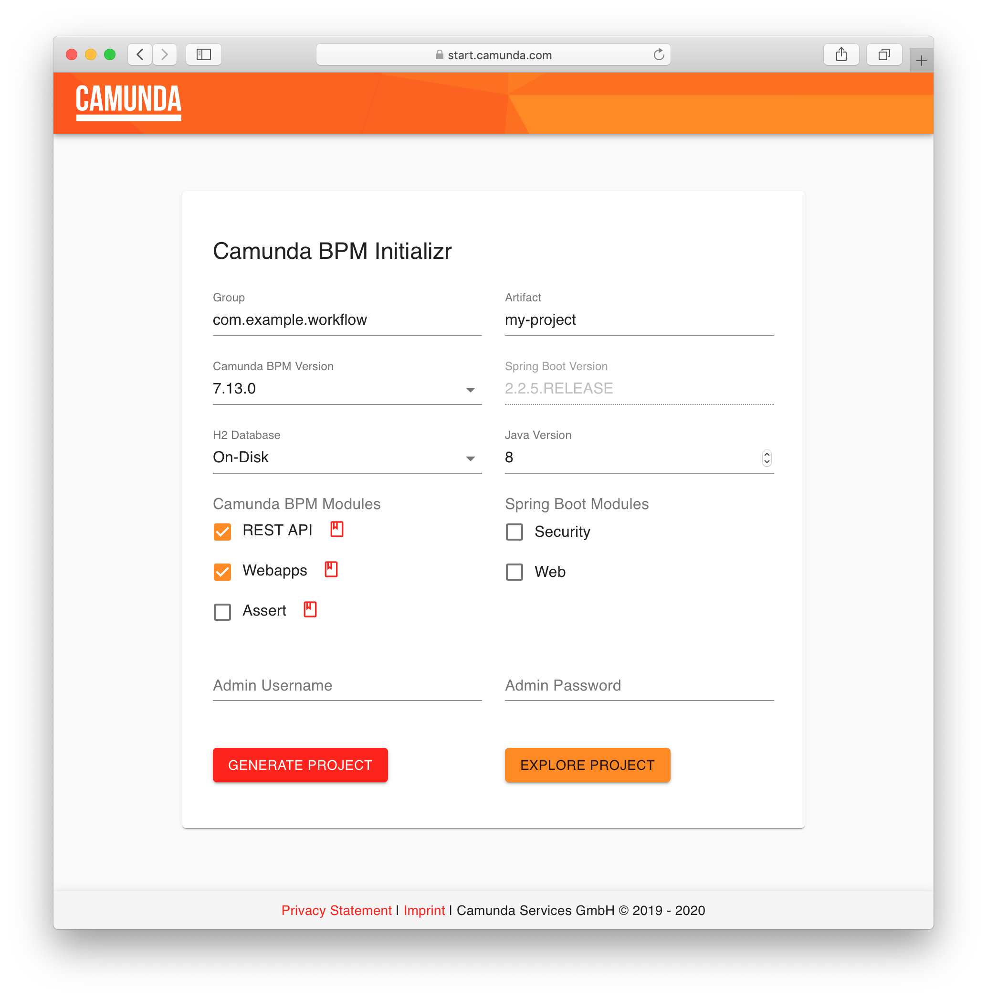

# Start Camunda Platform

A Webapp to generate & customize your Camunda Spring Boot Starter project.



## Build & Run

Make sure you have npm and maven installed.

### Backend
1. Go to the backend folder `cd ./backend`
2. Run `mvn clean install`
3. Run the Uber-Jar `java -jar ./target/start-camunda-0.0.1-SNAPSHOT.jar`

### Frontend Development (Optional)
If you want to develop the frontend separately:
1. Go to the frontend folder `cd ./frontend`
2. Run `npm install`
3. Run `npm run dev` (starts Vite dev server on http://localhost:3000)
4. The frontend will proxy API calls to the backend at http://localhost:9090

### Full Application
Open the following link in your browser: [http://localhost:9090](http://localhost:9090)

### Using docker
1. run `docker build . -t start-camunda`
2. run `docker run --rm -it -p9090:9090 start-camunda`
3. Open the following link in your browser: [http://localhost:9090](http://localhost:9090)

### Deploy to ECS

1. `docker build -t registry.camunda.cloud/team-cambpm-public/start.camunda.com:$TAG .`
   * `$TAG`: Docker image tag
2. `docker push registry.camunda.cloud/team-cambpm-public/start.camunda.com:$TAG`
3. `aws ecs list-task-definitions --family-prefix ecs_start_camunda_com --profile StartCamundaCom-578853869218`
   * Shows a list of task definition versions
4. Adjust `$TAG` in `./ecs-task-definition.json` 
5. ```
   aws ecs register-task-definition \
   --execution-role-arn arn:aws:iam::$ACCOUNT_ID:role/ecsTaskExecutionRole \
   --cli-input-json file://./ecs-task-definition.json \
   --profile StartCamundaCom-578853869218
   ```
   * `$ACCOUNT_ID`: AWS Account ID
6. ```
   aws ecs update-service --cluster arn:aws:ecs:eu-central-1:$ACCOUNT_ID:cluster/startcamundacom \
   --service arn:aws:ecs:eu-central-1:$ACCOUNT_ID:service/startcamundacom/start_camunda_com_V2 \
   --task-definition arn:aws:ecs:eu-central-1:$ACCOUNT_ID:task-definition/ecs_start_camunda_com:$VERSION \
   --profile StartCamundaCom-578853869218
   ```
   * `$VERSION`: New task definition version